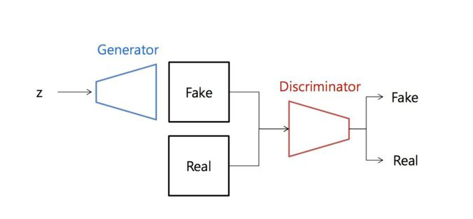

# CH1. GAN 시작하기

**이번 챕터에서 중요한 점**

- 생성자 : 노이즈를 받아 진짜 같은 가짜를 만들어내고자 한다.
- 판별자 : 진짜를 진짜로, 가짜를 가짜로 판별하고자 한다.
- 서로 잘되는 꼴은 못본다.
- 우리의 목표는 생성자가 이기는 것!!

**GAN(Generative Adversarial Network)**
생성적 적대 신경망 : 동시에 두 개의 모델을 훈련하는 머신러닝의 한 종류

두 개의 모델은 서로 이기려는 경쟁을 한다.

- 생성자 - 가짜 데이터를 생성하도록 훈련
- 판별자 - 진짜와 가짜를 구분하도록 훈련

|      | 생성자                                                     | 판별자                                                   |
| ---- | ---------------------------------------------------------- | -------------------------------------------------------- |
| 입력 | 랜덤한 숫자로 구성된 벡터                                  | 훈련 데이터셋의 진짜 샘플, 생성자가 만든 가짜 샘플       |
| 출력 | 최대한 진짜 같아 보이는 가짜 샘플                          | 입력 샘플이 진짜일 예측 확률                             |
| 목표 | 훈련 데이터셋에 있는 샘플과 구별이 불가능한 가짜 샘플 생성 | 생성자가 만든 가짜 샘플과 훈련 데이터셋의 진짜 샘플 구별 |

**GAN 시스템**

**생성자 학습과정**

1. 노이즈 벡터를 입력받은 생성자가 가짜 이미지를 생성한다.
2. 가짜 이미지를 판별자에 넣어 진짜일 확률을 계산한다.
3. 손실값을 계산한다(생성자는 가짜 이미지가 진짜로 판별되는 방향으로 학습하기 때문에 진짜(1), 결과와의 Loss를 계산한다.)
4. 손실값을 바탕으로 역전파를 계산해 생성자의 가중치를 업데이트 한다.

**판별자 학습과정**

1. 생성자가 생성한 이미지를 판별자에 넣어 확률을 계산하고 0과의 Loss를 계산한다(가짜를 가짜로 판별하기 위해)
2. 학습 데이터인 진짜 이미지를 판별자에 넣어 확률을 계산하고 1과의 Loss를 계산한다(진짜를 진짜로 판별하기 위해)
3. 위에서 구한 두개의 Loss 를 더해 판별자의 최종 Loss를 구한다.
4. 손실값을 바탕으로 역전파를 계산해 판별자의 가중치를 업데이트한다.

여기서 중요한 것은 두개의 모델이 적대적이라는 것이다. 하나가 좋아지면 다른 하나가 안좋아진다. (제로섬)

**그럼 언제 학습이 끝나?**

방금 이야기 했다시피 두 네트워크의 목표가 다르다. 언제 훈련을 중단해야 할까?

이는 게임이론에 기반으로 한 제로섬 게임이다. 제로섬 게임은 이득을 더 이상 볼 수 없는 지점 내시균형에 도달하면 종료된다.

- 생성자가 훈련 데이터셋의 실제 데이터와 구별이 안 되는 데이터를 생성할 때
- 판별자가 할 수 있는 최선이 특정 샘플이 무엇인지 찍는 지점

내시균형에 도달하면 GAN은 **수렴**했다고 이야기한다. 하지만 이는 거의 불가능에 가깝다. 

*실제론 GAN의 수렴은 GAN 연구에서 가장 중요한 미결 문제 중 하나!!*

> "지난 20년간 딥러닝 분야에서 가장 멋진 아이디어" - Yann Lucun

GAN은 [인공 일반 지능](https://ko.wikipedia.org/wiki/%EC%9D%B8%EA%B3%B5_%EC%9D%BC%EB%B0%98_%EC%A7%80%EB%8A%A5)의 완성에 꼭 필요한 **창의성**을 위한 디딤돌