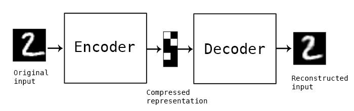

# CH2. 오토인코더와 생성 학습

**이번 챕터에서 중요한 점**

- 오토인코더는 입력을 표현하는 잠재벡터를 찾을 수 있다.
- 변이형 오토인코더의 학습은 입력 데이터의 분포를 찾는 과정이다.

**뜬금없이 오토인코더??**

생성 모델은 아주 도전적인 과제이지만, 오토인코더는 여러가지 면에서 흔히 배우는 모델과 비슷하다.

또한 좋은 성과를 내는 최근 논문들이 오토인코더에서 영감을 받았다.

**오토인코더 구성**

- 인코더
- 디코더

**인코더**

- 입력을 표현할 수 있는 의미있는 벡터를 생성해낸다. (잠재벡터)
- 차원 축소(압축)
- 훨씬 작은 차원으로 데이터를 표현

**디코더**

- 잠재벡터로 기존의 정보를 복구
- 해독

**AutoEncoder Model Structure**

**잠재표현(latent vector)**

- 위 사진에서 가운데에 있는 벡터
- 데이터를 더 간단하게 표현한 숨겨진 표현방식
- 좋은 잠재표현은 공간에서 유사한 데이터들을 표현할 수 있다.

**GAN과 오토인코더 차이점**

- GAN : 두개의 손실함수, 명시적 지표 없음, 경쟁하는 두가지 모델
- 오토인코더 : 하나의 손실함수, 명시적 지표(MSE, ROC)

**오토인코더 학습**

1. 이미지를 오토인코더에 입력
2. 재구성된 이미지 생성
3. 입력 이미지와 재구성 이미지로 손실값 측정
4. 학습

**오토인코더 활용**

- 입력의 압축된 표현
  - 유사도를 빠르게 확인할 수 있음
  - 이상치 탐지
- 이미지 노이즈 제거 및 흑백 이미지 채색

 

*특정 클래스의 이미지는 특정 이미지의 분포로 설명할 수 있다. 비슷한 이미지를 생성해내는 GAN도 결국 이미지의 분포를 찾아내는 Task이다.*

**변이형 오토인코더(Variational Autoencoder)**

잠재공간을 단순히 수의 집합이 아닌 학습된 평균과 표준편차를 지닌 분포로 표현한다.

학습의 목표는 분포를 정의하기 위한 알맞은 파라미터를 찾는 것

-> **최대 가능도 추정(maximum likelihood estimation)**