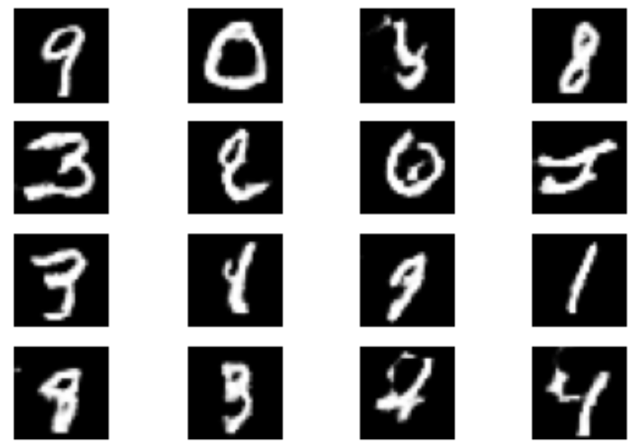

# DCGAN

**이번 챕터에서 중요한 점**

- ??
- ??

이전 3장에서 배웠던 GAN은 Dense 레이어만을 이용해서 GAN을 구현했었다. 이미지 처리에 특화된 ConvNet을 이용한다면 더 나은 모델을 만들 수 있지 않을까? **DCGAN**

사실 DCGAN이 나오기전에도 ConvNet을 이용한 생성모델은 많은 시도를 거쳤는데, 불안정성과 Gradient Saturation이 문제가 되었다고 한다. Gradient Saturation에 대한 내 의견은 생성자에 비해 판별자가 빠르게 학습이 되기 때문에 문제가 발생했다고 생각한다.

이 문제를 해결해주는 해결책이 바로 **배치 정규화**이다. 배치정규화는 각 층의 입력을 정규화하여 안정적으로 훈련을 도와준다.

정규화는 평균이 0이고 단위분산을 가지도록 데이터의 스케일을 조정하는 것이다. 평균값과 분산값에 대한 scaling과 shifting 정도 또한 학습을 통해 조정된다.

Epoch 50으로 아래와 같은 이미지를 생성할 수 있었다.

