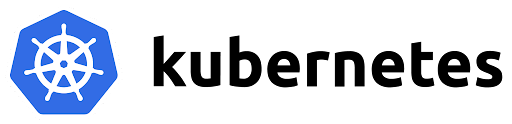
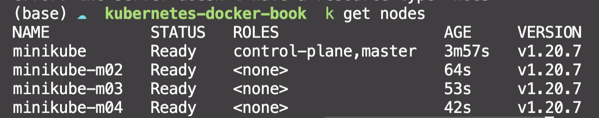
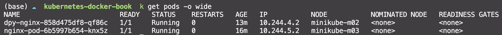
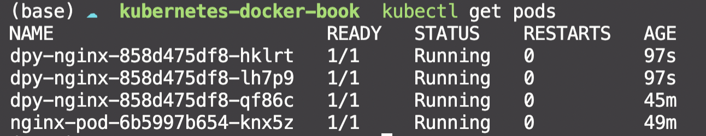

# 컨테이너 인프라 환경 구축을 위한 쿠버네티스/도커 정리

**목차**

1. 새로운 인프라 환경이 온다
2. 테스트 환경 구성하기
3. 컨테이너를 다루는 표준 아키텍처, 쿠버네티스
4. 쿠버네티스를 이루는 컨테이너 도우미, 도커
5. 지속적 통합과 배포 자동화, 젠킨스
6. 안정적인 운영을 완성하는 모니터링, 프로메테우스와 그라파나


# CH1. 새로운 인프라 환경이 온다.

**새로운 컨테이너 인프라 환경**<br>
사용자가 요구하는 인프라를 즉각 제공하는 주요 기능은 유지하면서, 사용자마자 독립적인 환경에서 개발해도 모두 동일한 결과를 얻을 수 있고 개발된 소프트웨어의 성능을 보장하며 인프라의 가용 리소스를 최대한 확보할 수 있는 인프라 환경

## 1.1 컨테이너 인프라 환경이란

**컨테이너**<br>
하나의 운영 체제 커널에서 다른 프로세스에 영향을 받지 않고 독립적으로 실행되는 프로세스 상태 -> 가상화보다 가볍고 빠르게 동작

**모놀리식 vs 마이크로 서비스**


    사진을 보고 아래의 표를 번갈아보면 왜 그런지 이해가 될 것이다.

| 모놀리식 | 마이크로 서비스 | 
| --- | --- |
| 개발이 빠르다 | |
| 코드 관리 간결 | |
| | 재사용성 |
| | 확장성 |
| | 유연함 |
| | 독립적 |

## 1.2 컨테이너 인프라 환경을 지원하는 도구

**도커**<br>


컨테이너 환경에서 독립적으로 애플리케이션을 실행할 수 있도록 컨테이너를 만들고 관리하는 것을 도와주는 컨테이너 도구. 도커로 애플리케이션을 실행하면 운영 체제 환경에 관계없이 독립적인 환경에서 일관된 결과를 보장한다.

<br/>

**쿠버네티스**<br>



쿠버네티스는 컨테이너화된 워크로드와 서비스를 관리하기 위한 이식성이 있고, 확장가능한 오픈소스 플랫폼이다. 쉽게 말하자면, 다수의 컨테이너를 관리하는 데 사용하는 도구이다. 

<br/>

**젠킨스**<br>


젠킨스는 지속적 통합과 지속적 배포를 지원하는 도구이다. 이는 코드의 빠른 적용과 효과적인 관리를 통해 개발 생산성을 높이는 데 기여한다.

<br/>

**프로메테우스와 그라파나**<br>


프로메테우스와 그라파나는 모니터링을 위한 도구이다. 프로메테우스는 데이터를 수집하고 그라파나는 이를 시각화한다. 

<br/>

# CH2. 테스트 환경 구성하기

일관성 있는 결과를 얻기 위해선 프로젝트 환경이 가능한 한 일정하게 생성되고 유지돼야 한다. 그래서 코드형 인프라로 인프라 환경을 일정하게 유지하고 구성한다. **코드형 인프라**는 코드로 하드웨어를 설정하고, 운영 체제를 설치하고, 네트워크를 구성하고, 개발 환경을 구축하는 것이다. 다시말하면 코드로 인프라를 소프트웨어처름 다루는 것

> 여기서부터 2장은 윈도우 환경에서 Vagrant로 VirtualBox에 가상 머신을 설치하는 방법이 자세히 나온다. 나는 Ubuntu를 사용하기 때문에 불필요한 과정


<br/>

# CH3. 컨테이너를 다루는 표준 아키텍처, 쿠버네티스

**컨테이너 인프라 환경**이란 리눅스 운영 체제의 커널 하나에서 여러 개의 컨테이너가 격리된 상태로 실행되는 인프라 환경을 말한다. 

## 3.1 쿠버네티스 이해하기

쿠버네티스: 컨테이너 오케스트레이션을 위한 솔루션 <br>

**오케스트레이션**이란 다수의 컨테이너를 유기적으로 연결, 실행, 종료할 뿐만 아니라 상태를 추적하고 보존하는 등 컨테이너를 안정적으로 사용할 수 있게 만들어주는 것

오케스트레이션을 위한 다양한 툴이 있지만 쿠버네티스가 그 중 일등!!

다양한 툴
- 도커 스웜
- 메소스
- 노매드
- 쿠버네티스 

**쿠버네티스를 구성하는 방법 3가지**

1. EKS, AKS, GKE -> 구성이 이미 다 되어 있기 때문에 학습에 부적합

2. Rancher, OpenShift -> 유료라 부적합

3. kubeadm, KRIB, kubespray -> 클러스터 자동 구성 솔루션

<br>


> 위에선 구성형 쿠버네티스로 3가지만 소개되었지만 Minikube도 이와 같은 역할을 도와준다고 생각한다. 그래서 나는 책을 구성과 조금 다르지만 minukube를 통해 같은 환경을 구성해보겠다.


총 4개의 노드 구성하기 (master ndoe, 3 worker node)
```bash
minikube start --nodes 4
```


<br/>

**개발자 파드 배포 시 과정**

<마스터 노드>

1. kubectl
    
    쿠버네티스 클러스터에 명령을 내리는 역할 -> 마스터 노드에 내림

2. API 서버

    클러스터의 중심 역할을 하는 통로, 주로 etcd와 통신함 -> 관리자

3. etcd

    구성 요소들의 상태가 모두 저장되는 곳 -> 관리자의 노트

4. 컨트롤러 매니저

    클러스터의 오브젝트 상태 관리 -> 통신 상태 체크, 복구

5. 스케줄러

    파드를 어떤 워커 노드에 생성할지 결정 및 할당 -> 일정 관리


<br/>

<워커 노드>

5. kubelet

    파드의 구성 내용을 받아 컨테이너 런타임으로 전달, 컨테이너 동작 확인, 모니터랑

6. 컨테이너 런타임

    파드를 이루는 컨테이너의 실행을 담당 

7. 파드

    한 개 이상의 컨테이너로 단일 목적의 일을 하기 위해 모인 단위 -> 웹서버 or 로그 분석

    **언제든 죽을 수 있는 존재** -> 여러 대안이 존재

<br/>

<선택 가능한 구성 요소>

11. 네트워크 플러그인

    쿠버네티스 클러스터의 통신을 위해서 네트워크 플러그인을 선택하고 구성해야 한다. 일반적으로 CNI(Container Network Interface)로 구성한다.

    *처음보는 개념이라 꼭 필요한지 잘 모르겠다. 책에선 Calico를 사용한다. 필요에 따라 설치하자.*

    `kubectl apply -f https://docs.projectcalico.org/manifests/calico.yaml`

12. CoreDNS

    빠르고 유연한 DNS 서버이다. 쿠버네티스 클러스터에 도메인 이름을 이용해 통신하는 데 사용

<br/>

**사용자 파드 접속 시 과정**

파드가 배포된 이후 사용자 입장에서 배포된 파드에 접속하는 과정

1. kube-proxy

    쿠버네티스 클러스터는 파드가 위한 노드에 kube-proxy를 통해 파드가 통신할 수 있는 네트워크를 설정한다. 이때 실제 통신은 br-netfilter, iptables로 관리한다.

2. 파드

    이미 배포된 파드에 접속하고 필요한 내용을 전달 받는다. 어떤 워커노드에 있는지는 중요하지 않다.


<br>

> 파드가 배포되는 과정을 다시 천천히 살펴보자

**파드의 생명주기**
: 생성, 수정, 삭제

1. kubectl을 통해 API 서버에 파드 생성을 요청한다.
2. API 서버에 전달된 내용이 있으면 API 서버는 etcd에 전달된 내용을 모두 기록해 클러스터의 상태 값을 최신으로 유지한다. 따라서 각 요소가 상태를 업데이트할 때마다 모두 API 서버를 통해 etcd에 기록된다.
3. API 서버에 파드 생성 요청이 되면 컨트롤러 매니저가 인지하여 파드를 생성한다. 그리고 상태를 API 서버에 전달한다. 
4. 스케줄러가 파드를 어떤 워커노드에 적용할지 결정하고 워커노드에 요청한다.
5. 스케줄러가 kubelet을 통해 파드가 잘 생성되었는지 확인한다.
6. kubelet에서 컨테이너 런타임으로 파드 생성을 요쳥한다.
7. 파드가 생성된다.
8. 파드가 사용가능한 상태가 된다.


> 쿠버네티스는 작업을 순서대로 진행하는 워크플로 구조가 아니라 선언적인 시스템 구조를 가지고 있다. 즉, 각 요소가 추구하는 상태를 선언하면 현재 상태와 맞는 지 점검하고, 그것에 맞추려고 노력하는 구조로 되어있다.

<br/>

**kubelet**<br>

쿠버네티스에서 파드의 생성과 상태 관리 및 복구 등을 담당하는 매우 중요한 구성 요소이다. 

*kubectl -f 에서 f는 filename을 의미한다.*

**kube-proxy**<br>

파드의 통신을 담당한다. 

<br/>

## 3.2 쿠버네티스 기본 사용법 배우기

### 파드를 생성하는 방법
> 쿠버네티스를 사용한다는 것 == 효과적으로 파드를 제공하는 것

**run**<br>

```bash
kubectl run nginx-pod --image=nginx
```

**deployment**<br>

```bash
kubectl create deployment dpy-nginx --iamge=nginx
```

**동작확인**<br>

```bash
kubectl get pods -o wide
```



```bash
curl 10.244.4.2
```
*위 명령어를 실행하면 nginx의 HTML 소스를 가져와야 하는데 나는 반응하지 않았다. 내가 지금 쿠버네티스가 설치된 PC에 SSH로 접근해서 그런건가 싶지만 정확한 이유를 모르겠다..*

-> port-forward를 해서 확인해보았다. 

```bash
kubectl port-forward --address 0.0.0.0 pod/dpy-nginx-858d475df8-qf86c 8888:80

curl localhost:8888 
```

잘 동작했다. 

위에서 run 방식과 create 방식으로 pod를 생성했다. 이 두 방식의 차이는 단일 pod를 생성하느냐 deployment가 관리하는 pod를 생허나느냐의 차이이다. 책의 예시로는 run으로 만든 pod는 하나의 초코파이이고 create deployment를 이용해 만든 pod는 초코파이 상자에 들어있는 초코파이이라고 한다.

그러면 deployment를 조금 더 알아보자

### 오브젝트

pod, deployment는 스펙과 상태 등의 값을 가진다. 이러한 값을 가지고 있는 객체들을 오브젝트라고 부른다. 쿠버네티스는 여러 유형을 오브젝트를 제공한다.

> 기본 오브젝트

**파드**<br>
쿠버네티스에서 진행되는 최소 단위, 서비스를 위한 최소한의 단위이다. 독립적인 공간과 사용 가능한 IP를 가지고 있다. 파드는 1개 이상의 컨테이너를 가질 수 있다.

**네임스페이스**<br>
리소스들을 구분해 관리하는 그룹이다. 기본적으로 `default`, 쿠버네티스 시스템에선 `kube-system` 을 사용한다.

**볼륨**<br>
파드가 생성될 때 파드에서 사용할 수 있는 디렉토리를 제공한다. 기본적으론 임시 디렉터리가 생성되지만 저장과 보존이 가능한 볼륨 오브젝트를 통해 관리할 수 있다.

**서비스**<br>
파드는 클러스터 내에서 유동적이기 때문에 접속 경로가 고정일 수 없다. 따라서 파드의 접속을 안정적으로 유지하도록 서비스를 통해 내/외부로 연결할 수 있다! 

외부에서 쿠버네티스로 접근할 때 파드의 상태와 구조에 상관없이 논리적으로 연결해준다. 기본 인프라에서 로드밸런서, 게이트웨이와 비슷한 역할을 한다. 

<br/>

> 디플로이먼트

위애서 설명한 기본 오브젝트로도 쿠버네티스 구성이 가능하다. 하지만 더 디플로이먼트를 사용하면 더 효율적인 쿠버네티스 인프라를 구성할 수 있다. 이외에도 ConfigMap, ReplicaSet, PersistentVolume, PersistentVolumeClaim, StatefulSet 등이 있다. 요구 사항에따라 목적에 맞는 오브젝트를 사용하면 된다.

**쿠버네티스에서 가장 많이 사용하는 디플로이먼트**는 파드에 기반을 두고있으며 ReplicaSet을 합쳐놓은 형태이다. 

<br/>

### 디플로이먼트가 필요한 이유!

**레플리카셋으로 파드 수 관리하기**

많은 사용자를 대상으로 서비스를 하려면 여러개의 파드가 필요하다. 이를 하나씩 생성하면 매우 비효율적이다. 그래서 쿠버네티스에선 레플리카셋이라는 오브젝트를 제공한다. 그런데 디플로이먼트는 이 레플리카셋이라는 오브젝트를 포함하고 롤링 업데이트까지 지원하니 Deployment를 사용하는 것이다!!

*롤링 업데이트란 새 버전을 배포하면서, 새 버전 인스턴스를 하나씩 늘려가고 기존 버전의 인스턴스를 하나식 줄여나가는 방식을 이야기한다*

deployment로 생성한 pod scale up!!
```bash
kubectl scale deployment dpy-nginx --replicas 3
```
Result


3개의 pod가 추가로 생성되었고 각각은 다른 IP를 가진다.